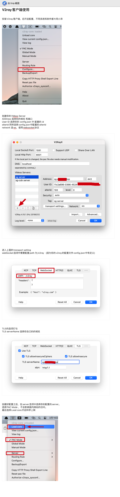

## v2ray客户端安装

- 前面安装的是v2ray的服务端，还需要安装v2ray客户端，个人电脑上网时通过客户端连接到v2ray服务端，v2ray服务端对请求进行转发，从而实现科学上网。

- 下载客户端

	- iphone客户端需要使用海外的APPID，花几美元下载小火箭
	
	- 安卓的客户端可以下载v2rayNG：
	
		- https://github.com/2dust/v2rayNG/releases/download/1.7.38/v2rayNG_1.7.38.apk
	
	- windows客户端可以去github安装对应的v2rayN的release版本，例如：
	
		- https://github.com/2dust/v2rayN/releases/download/6.0/v2rayN.zip
	
	- mac客户端可以直接去github安装对应的v2rayX的release版本，例如：
	
		- https://github.com/Cenmrev/V2RayX/releases/download/v1.5.1/V2RayX.app.zip

  

## 客户端配置参考

- 当前默认v2ray加的目录前缀改成/v2了，需要注意下。

- 我这边使用mac版本的v2rayX

## 验证
- https://www.google.com/ 谷歌可以正常打开说明的科学上网可以正常了 