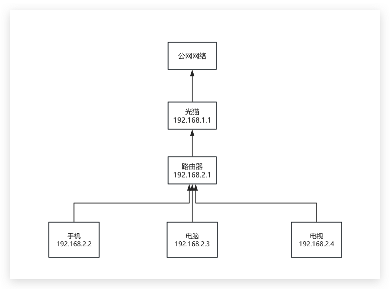
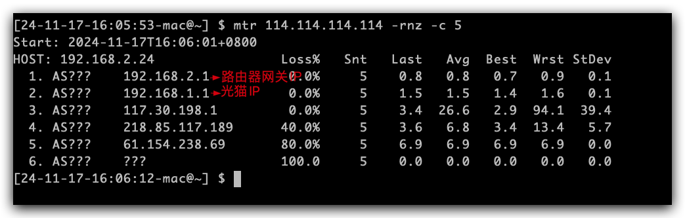
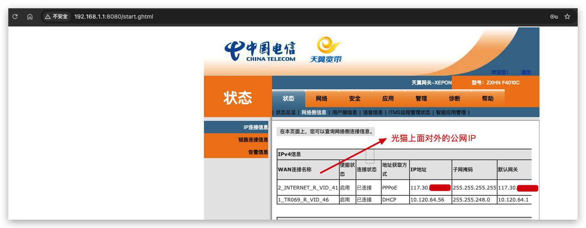
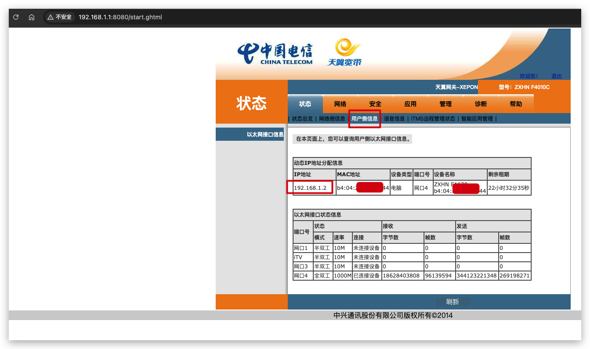
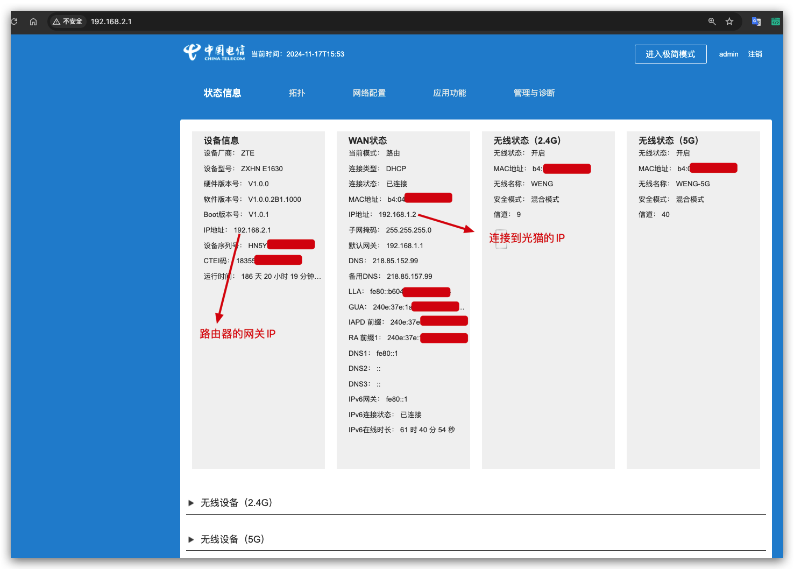
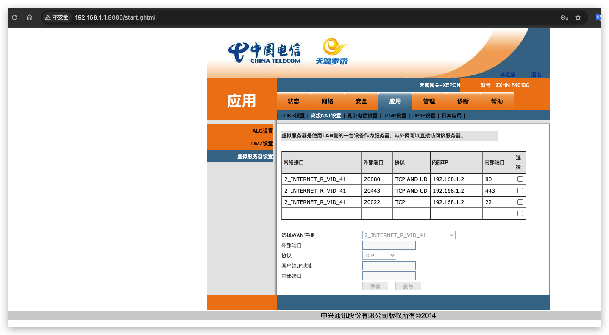
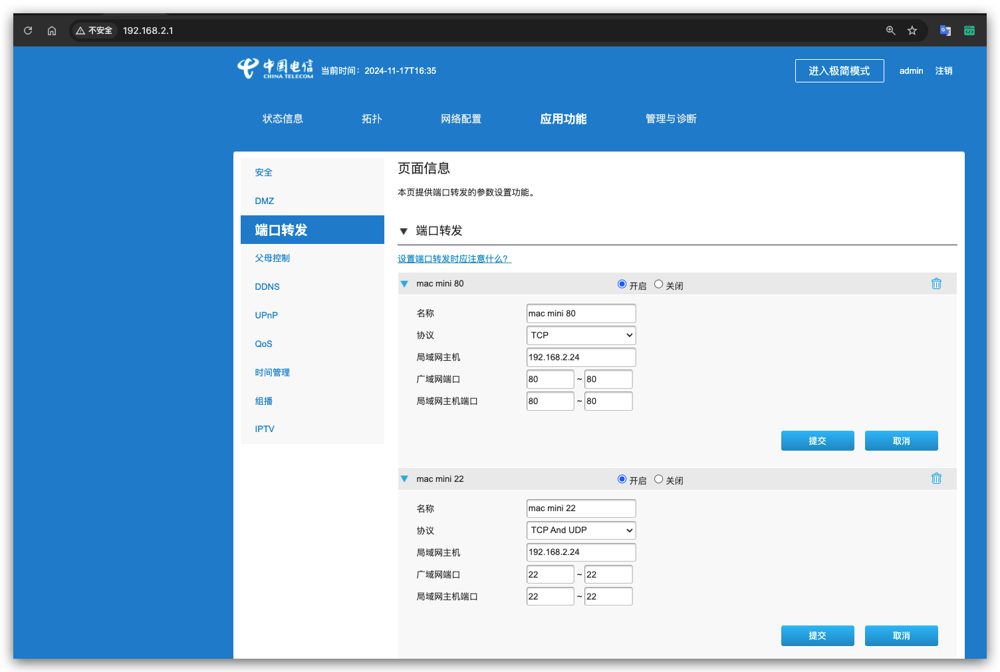
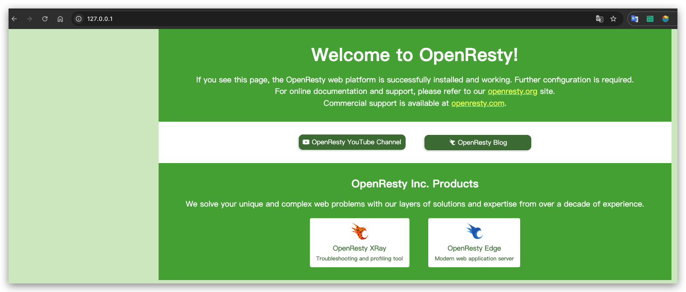
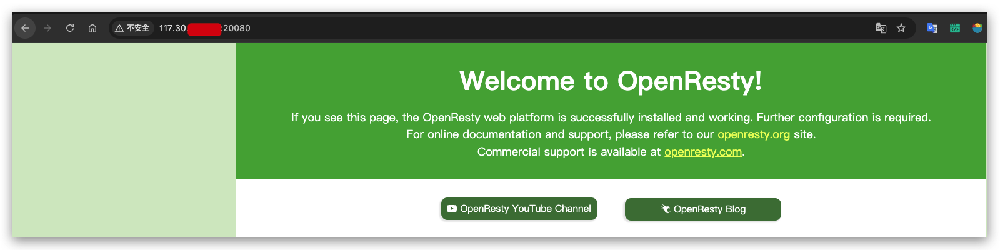

- ## 申请公网IP

- 家庭宽带通常不会需要给你家的路由器分配独立的公网IP，需要你额外申请。
- 公网 IP 的申请比较方便，只需要打电话给对应运营商客服说你需要公网 IP 就行，例如我的电信宽带就是直接打10000号转人工，客服会直接帮你操作，一般来说 24 小时内就能搞定了。注意有时候客服会问你要公网 IP 做什么，你就回答工作需要或者访问家里的监控之类的原因就行，但是不要说自己在家里面架设网站。
- 但是需要注意的是，公网IP是动态的，IP不是固定的，可能隔几天就换了。所以后面提到，使用本机上面的定时任务，定时更新阿里云域名解析为本机的公网IP。

  

- ## 配置光猫和路由器

- 对外请求流程（以为我自家路由器为例）：

	- 

	- 例如我对外的mtr路径如下：

		- 

- 光猫：【192.168.1.1】

	- 说明：
		- 将光纤传输的光信号转换为电信号，以便连接到家庭内部网络设备。
		
		- 位置：通常位于入户处，与运营商提供的光纤直接相连。
		
		- 主要任务是光电转换，并可能提供基本的数据转发功能。
		
		- 可以浏览器直接访问光猫的地址，登录后进行设置（密码一般位于光猫底部）
	
	- 以我自己家里的光猫为例：
	
		- 这里的申请的公网动态IP是配置在光猫上面
		
		- 这里连接在光猫网口4的192.168.1.2即我自己的路由器

		- 

		- 

- 路由器：【192.168.1.2】

	- 说明：
	- 作用：负责管理数据包在局域网内的分发以及对外网的访问控制。
	
	- 位置：一般放置在家中较为中心的位置，以确保无线信号覆盖范围最广。
	
	- 提供的主要功能包括IP地址分配、NAT（网络地址转换）、防火墙保护、Wi-Fi接入点等。
	
	- 可以浏览器直接访问路由器的地址，登录后进行设置（密码一般位于路由器底部）
	
	- 

- 配置公网的端口映射
	- 不同运营商设备可能web页面不太一样，整体应该差不多

	- 进入光猫的web的配置管理页面【应用】【虚拟服务器设置】【高级nat设置】
	
		- 这里实际上是将访问的公网IP的端口映射到路由器上，然后路由器再进行转发
		
		- 所以这里的内部IP要填路由器的IP：192.168.1.2，这里的端口根据你的需要进行设置
		
		- 例如我这边将公网的20080映射到路由器的80端口

		- 

	- 进入路由器的web的配置管理页面【应用功能】【端口转发】
	
		- 这里实际上是将访问的路由器IP的端口映射到你的网络设备的内网IP：192.168.2.24
		
		- 由于光猫已经配置了端口映射，所以这里将光猫的80端口映射到内网IP：192.168.2.24的80端口

		- 

- 验证

	- 我这边本地安装了一个openresty，访问127.0.0.1:80，openresty服务器确实起来了
	
	- openresty服务安装可以参考：https://openresty.org/cn/download.html

	- 

	- 再浏览器访问：http://公网IP:20080，自己电脑的的公网IP直接百度搜索一下IP就可以看到了。
	
	- 这里本机访问自生网络的公网IP会不通，这个地方有点奇怪，但是换一个网络进行访问是这个可以正常的

	- 

## 参考

- https://sspai.com/post/79532

- https://help.aliyun.com/document_detail/257181.html?shareId=5b298fa01693637b51c37f4b5ffd7efd