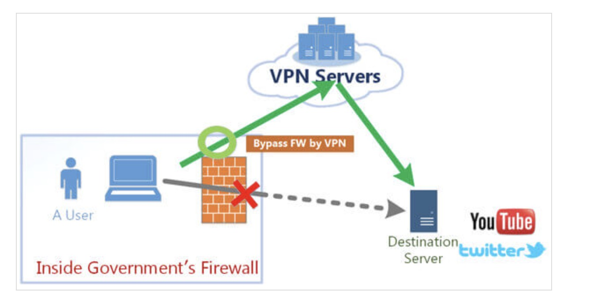
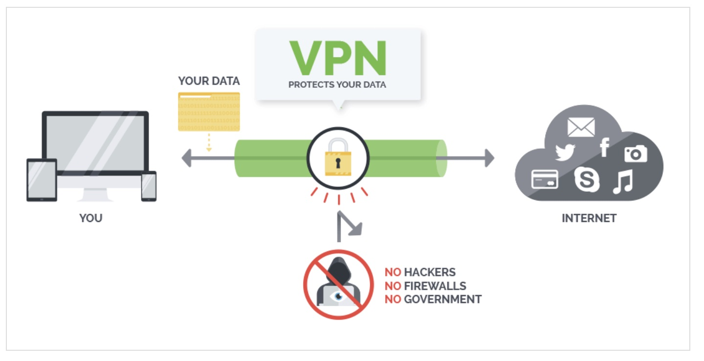

## VPN介绍

- 什么是VPN？（参考：[地址](https://superxlcr.github.io/2018/07/01/%E4%B8%8A%E7%BD%91%E9%99%90%E5%88%B6%E5%92%8C%E7%BF%BB%E5%A2%99%E5%9F%BA%E6%9C%AC%E5%8E%9F%E7%90%86/)）
  - 虚拟专用网（英语：Virtual Private Network，简称VPN），是一种常用于连接中、大型企业或团体与团体间的私人网络的通讯方法。虚拟私人网络的讯息透过公用的网络架构（例如：互联网）来传送内联网的网络讯息。它利用已加密的通道协议（Tunneling Protocol）来达到保密、发送端认证、消息准确性等私人消息安全效果。
  
- 正常网络通信时，所有网络请求都是通过我们的物理网卡直接发送出去。而VPN是客户端使用相应的VPN协议先与VPN服务器进行通信，成功连接后就在操作系统内建立一个虚拟网卡，一般来说默认PC上所有网络通信都从这虚拟网卡上进出，经过VPN服务器中转之后再到达目的地。
  
- 通常VPN协议都会对数据流进行强加密处理，从而使得第三方无法知道数据内容，这样就实现了翻墙。翻墙时VPN服务器知道你干的所有事情（HTTP，对于HTTPS，它知道你去了哪）。
- VPN有多种协议：OPENVPN、PPTP、L2TP/IPSec、SSLVPN、IKEv2 VPN，Cisco VPN等。其中的PPTP和L2TP是明文传输协议。只负责传输，不负责加密。分别利用了MPPE和IPSec进行加密。

## 数据加密的过程
- 本文介绍和推荐的方式是使用Vmess+Websocket+TLS的加密过程
- Vmess 的加密机制
```
Vmess 是 V2Ray 的自定义协议，专门设计用于代理通信。它的加密和认证过程如下：

步骤 1：请求认证
    Vmess 协议会对每个请求头添加认证信息，包括时间戳和用户标识。
    使用对称加密算法（通常是 AES）对认证信息进行加密，确保只有双方可以解密并校验。
步骤 2：流量加密
  数据在客户端加密后通过 Vmess 传输到服务端。
  加密算法：
    AES-128-GCM 或 ChaCha20-Poly1305 等对称加密算法。
    对称加密密钥由服务器预先配置，或通过 Diffie-Hellman 协议动态生成。
```
- websocket+TLS
  - 这个简单说就是支持客户端和服务端全双工的https协议

- 完整数据加密和通信流程
  - 客户端到服务端的流程
    - TLS 加密
      - 客户端与服务端建立 TLS 安全通道，生成会话密钥，用于保护传输层数据的机密性和完整性。
    - WebSocket 握手
      - 客户端通过 TLS 通道向服务端发起 WebSocket 握手。
      - 握手后，WebSocket 连接升级，开始双向数据传输。
    - Vmess 数据加密
      - 客户端使用 Vmess 协议对数据加密并添加认证信息。 
      - 加密数据通过 WebSocket 数据帧发送到服务端。
    - 数据传输
      - 加密后的数据嵌套在 WebSocket 中，最终通过 TLS 通道传输到服务端。
  - 服务端的解密过程
    - 服务端通过 TLS 解密外层的加密数据，获取 WebSocket 数据帧。
    - 从 WebSocket 数据帧中提取 Vmess 数据。
    - 使用 Vmess 协议解密数据并校验认证信息。
    - 将解密后的原始数据转发到目标服务器（如网站或其他服务）。

- 加密层次总结
  - Vmess+WebSocket+TLS 的加密涉及多层嵌套：
    - 第一层：TLS
      - 提供传输层加密，保护整个通信隧道。
    - 第二层：WebSocket
      - 将流量伪装为普通的 HTTP(S) 通信，增加隐匿性。
    - 第三层：Vmess
      - 对数据内容进行加密和认证，确保通信双方身份可靠且数据完整。

- 安全性分析
  - 通过这个Vmess+Websocket+TLS方式的请求，在GFW来看就是客户端一直在和你v2ray的服务器的进行通信
  - 通信的数据是完全加密的，无法查看客户端真实访问的域名情况，但是可以看到你的v2ray的域名（因为SNI）
    - 所以可以自己自签一个IP证书，建议不用使用国内备案域名
  - 但是大部分人的v2ray都会搭建在海外，客户端长期和海外的IP进行通信在GFW看来还是比较可疑的。


## VPN+CND （进阶版）
- v2ray虽然已经走了https但是，一直访问境外的IP，被监测到还是可能会被封IP，最好的方式是在VPN前面再走一层CDN
  - 当前请求流程：
    - 客户端-->VPN-->目标服务器
  - VPN+CND请求流程
    - 客户端-->CDN-->VPN-->目标服务器
- 个人有尝试用过腾讯CDN（100G流量/每年20块，也可以接受）
    - 需要配置回源的 IP 和 host 即可，购买流量包后就可以正常使用
    - 使用CDN时延直接减少了一半，又安全又快，不过就是需要再花点钱。