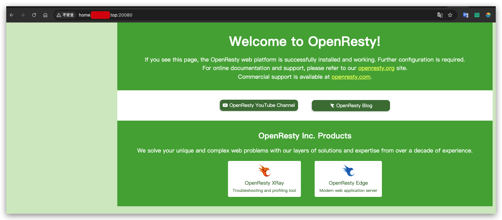

## 定时更新域名IP解析

- 上面的两步搞定之后，已经可以通过公网IP访问到你的内网的电脑了，但是还有有个问题就只这个公网IP是动态的。

- 所以我们建立一个任务来定时更新域名的解析为本机的公网IP，这一步要求你对python知识有基本的了解。

- 你需要你的局域网内的主机设置crontab执行域名解析更新python脚本，mac和linux系统都自带crontab，windows没有尝试过，可以试下wsl2.

- 我这边是申请一个阿里云的域名，便宜的一年就几块钱。

- 例如我这边自己设置的crontab如下，可以参考：（添加定时任务之前，自己先调试一下脚本，脚本根据你的需要进行修改）

- 直接运行即可以，详情查看脚本内容

- set_ip.sh中的python解释权路径和脚本路径根据你的实际情况进行修改

- crontab定时任务内容：

```

# 定时更新aliyun域名为本机公网IP

*/1 * * * * /Users/xxx/Library/Mobile\ Documents/com~apple~CloudDocs/xxx-icloud/me/tasks/set_ip.sh 2>&1|tee -a /Users/xxx/Library/Mobile\ Documents/com~apple~CloudDocs/xxx-icloud/me/tasks/set_ip.log

  

# 每天凌晨删除上面的日志

0 0 * * * rm -f /Users/yelingjie/Library/Mobile\ Documents/com~apple~CloudDocs/wengmq-icloud/me/tasks/set_ip.log

  

```

- set_ip.sh
```
#!/bin/zsh 

echo

date

/Users/xxx/.virtualenvs/p3/bin/python '/Users/xxx/Library/Mobile Documents/com~apple~CloudDocs/wengmq-icloud/me/tasks/ali_domain_set.py'
```

- ali_domain_set.py
```
#!/usr/bin/env python3

# coding= utf-8

import os

import json

from aliyunsdkcore.client import AcsClient

from aliyunsdkalidns.request.v20150109 import DescribeDomainRecordsRequest

from aliyunsdkalidns.request.v20150109 import UpdateDomainRecordRequest

class DnsHandler:

    """

    该类用于判断本地的公网IP是否发生变化，如果发生变化，则通过阿里云DNS API修改解析记录

    依赖阿里云的python模块（python3环境）：

        pip install aliyun-python-sdk-core

        pip install aliyun-python-sdk-alidns

    # step1: 创建RAM用户，并赋予AliyunDNSFullAccess权限

         # 参考： https://help.aliyun.com/document_detail/257181.html?shareId=5b298fa01693637b51c37f4b5ffd7efd

         # 创建好RAM用户之后记得，在右边的【添加权限】-> 【权限策略】 -> 搜索【AliyunDNSFullAccess】，然后添加

         # 获取Access_Key_Id和Access_Key_Secret

    # step2: 设置环境变量：

        export ALIBABA_CLOUD_ACCESS_KEY_ID='上面获取到的Access_Key_Id'

        export ALIBABA_CLOUD_ACCESS_KEY_SECRET='上面获取到的Access_Key_Secret'

    # step3: 阿里云上面创建好域名解析记录（例如：home.wengmq.top）

        # 需要提前购买你的阿里云域名，添加A记录

        # 设置好之后可以dig一下看是否生效

    """

    def __init__(self):

        """初始化，获取client实例

        """

        # 从阿里云开发者后台获取Access_Key_Id和Access_Key_Secret    

        self.access_key_id = os.environ['ALIBABA_CLOUD_ACCESS_KEY_ID'] 

        self.access_key_secret = os.environ['ALIBABA_CLOUD_ACCESS_KEY_SECRET'] 

        # 填入自己的域名后缀

        self.domain_name = "example.top"

        # 填入二级域名的RR值（域名前缀）

        self.rr_keyword = "home"

        # 解析记录类型，一般为A记录

        self.record_type = "A"

        # 用于储存解析记录的文件名

        script_dir = os.path.dirname(os.path.abspath(__file__))

        file_name = ".ip_addr"

        self.file_path = os.path.join(script_dir, file_name)

        self.client = AcsClient(

            self.access_key_id,

            self.access_key_secret

        )

        self.record = self.get_record()

        self.current_ip = self.get_current_ip()

    def reset(self):

        """如果公网IP发生变化，则自动修改阿里云解析记录

        """

        old_ip = self.get_record_value()

        print(f"current_ip: {self.current_ip}, old_ip: {old_ip}")

        if self.current_ip != old_ip:

            self.update_record(self.current_ip)

            print("IP changed, update DNS record successfully!")

            os.remove(self.file_path)

            self.get_record()

    def get_record(self):

        """获取阿里云域名解析完整记录，并使用文件缓存

        """

        if os.path.isfile(self.file_path):

            with open(self.file_path, 'r') as file_handler:

                r = file_handler.read()

        else:

            request = DescribeDomainRecordsRequest.DescribeDomainRecordsRequest()

            request.set_PageSize(10)

            request.set_action_name("DescribeDomainRecords")

            request.set_DomainName(self.domain_name)

            request.set_RRKeyWord(self.rr_keyword)

            request.set_TypeKeyWord(self.record_type)

            r = self.client.do_action_with_exception(request)

            with open(self.file_path, 'wb') as file_handler:

                file_handler.write(r)

                r = r.decode('utf-8')

        return json.loads(r)

    def get_record_id(self):

        """获取阿里云域名解析记录ID

        """

        return str(self.record["DomainRecords"]["Record"][0]["RecordId"])

    def get_record_value(self):

        """获取当前域名解析记录

        """

        return str(self.record["DomainRecords"]["Record"][0]["Value"])

    def update_record(self, value):

        """修改阿里云解析记录

        """

        request = UpdateDomainRecordRequest.UpdateDomainRecordRequest()

        request.set_action_name("UpdateDomainRecord")

        request.set_RecordId(self.get_record_id())

        request.set_Type(self.record_type)

        request.set_RR(self.rr_keyword)

        request.set_Value(value)

        return self.client.do_action_with_exception(request)

    def get_current_ip(self):

        """获取当前公网IP

        """

        cmd = "curl -s -4 http://ifconfig.me"

        current_ip = str(os.popen(cmd).read())

        return current_ip

if __name__ == '__main__':

    dns = DnsHandler()

    dns.reset()
```

  
  

## 说明

- 上面的步骤搞定之后，你就可以通过域名（解析到本机公网IP）访问到你局域网内的主机了，并且不用担心公网IP变化的问题。

- 在你的服务器上面建议可以用openresty进行转发你的web服务。

- 主机已经暴露在公网了，所以记得密码要设置强密码，防止被暴力破解，如果需要再安全一点，对外的服务可以走一层CDN，在CDN上做限流、限速、黑名单、白名单等。

- 

  

