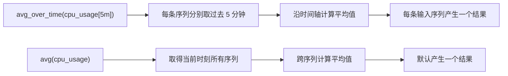

场景：avg_over_time函数和avg函数的区别？


核心区别是聚合维度不同：

- `avg_over_time`：沿时间轴聚合，同一条时间序列过去一段时间的样本。
- `avg`：沿序列维度聚合，计算当前时刻多条时间序列的平均值。





### `avg_over_time`：时间聚合

假设指标包含两台服务器：

```
cpu_usage{instance="server-a"}
cpu_usage{instance="server-b"}
```

查询：

```
avg_over_time(cpu_usage[5m])
```

含义是：

```
server-a = server-a 过去 5 分钟所有样本的平均值
server-b = server-b 过去 5 分钟所有样本的平均值
```

结果通常仍有两条序列，并保留各自的标签：

```
cpu_usage{instance="server-a"}  63
cpu_usage{instance="server-b"}  47
```

`cpu_usage[5m]` 是范围向量，`avg_over_time` 把每个范围向量压缩成当前时刻的一个样本。

### `avg`：跨序列聚合

查询：

```
avg(cpu_usage)
```

含义是取得当前时刻 `server-a`、`server-b` 等所有匹配序列的值，然后求平均：

```
(server-a 当前值 + server-b 当前值) / 2
```

默认只返回一条序列，并移除原有区分标签：

```
{} 55
```

可以使用 `by` 或 `without` 控制分组：

```
avg by (job) (cpu_usage)
```

表示当前时刻，按照 `job` 标签分组，对组内不同序列求平均。

### 两者结合

如果想先计算每台服务器过去 5 分钟的平均 CPU，再计算所有服务器的平均值：

```
avg(
  avg_over_time(cpu_usage[5m])
)
```

如果想按照集群聚合：

```
avg by (cluster) (
  avg_over_time(cpu_usage[5m])
)
```

### 常见 `_over_time` 函数

```
min_over_time(metric[5m])
max_over_time(metric[5m])
sum_over_time(metric[5m])
count_over_time(metric[5m])
quantile_over_time(0.95, metric[5m])
```

它们都针对每条序列在指定时间窗口内进行计算。

### 注意事项

`avg_over_time` 是对窗口中的样本做算术平均，每个样本权重相同，并不是严格的“按持续时间加权平均”。采集间隔不稳定时，两者可能有差异。

对于 Counter 类型指标，例如请求总数：

```
http_requests_total
```

通常不应直接使用：

```
avg_over_time(http_requests_total[5m])
```

而应先计算增长速率：

```
rate(http_requests_total[5m])
```

再跨实例聚合：

```
avg by (job) (
  rate(http_requests_total[5m])
)
```

一句话记忆：

```
xxx_over_time：一条序列在一段时间内怎么算
avg/sum/max：多条序列在同一个时刻怎么算
```