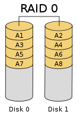

参考：[https://zh.wikipedia.org/wiki/RAID](https://zh.wikipedia.org/wiki/RAID)

## raid介绍

**独立硬盘冗余阵列**（**RAID**, **R**edundant **A**rray of **I**ndependent **D**isks），旧称**廉价磁盘冗余阵列**（**R**edundant **A**rray of **I**nexpensive **D**isks），简称**磁盘阵列**。利用虚拟化存储技术把多个硬盘组合起来，成为一个或多个硬盘阵列组，目的为提升性能或资料冗余，或是两者同时提升。

在运作中，取决于 RAID 层级不同，资料会以多种模式分散于各个硬盘，RAID 层级的命名会以 RAID 开头并带数字，例如：RAID 0、RAID 1、RAID 5、RAID 6、RAID 7、RAID 01、RAID 10、RAID 50、RAID 60。每种等级都有其理论上的优缺点，不同的等级在两个目标间获取平衡，分别是增加资料可靠性以及增加存储器（群）读写性能。

简单来说，RAID把多个[硬盘](https://zh.wikipedia.org/wiki/%E7%A1%AC%E7%A2%9F)组合成为一个逻辑硬盘，因此，[操作系统](https://zh.wikipedia.org/wiki/%E4%BD%9C%E6%A5%AD%E7%B3%BB%E7%B5%B1)只会把它当作一个实体硬盘。RAID常被用在[服务器](https://zh.wikipedia.org/wiki/%E4%BC%BA%E6%9C%8D%E5%99%A8)电脑上，并且常使用完全相同的硬盘作为组合。由于硬盘价格的不断下降与RAID功能更加有效地与[主板](https://zh.wikipedia.org/wiki/%E4%B8%BB%E6%A9%9F%E6%9D%BF)集成，它也成为普通用户的一个选择，特别是需要大容量存储空间的工作，如：视频与音频制作。

## 磁盘阵列比较表

**独立硬盘冗余阵列**（**RAID**, **R**edundant **A**rray of **I**ndependent **D**isks），旧称**廉价磁盘冗余阵列**（**R**edundant **A**rray of **I**nexpensive **D**isks），简称**磁盘阵列**。利用虚拟化存储技术把多个硬盘组合起来，成为一个或多个硬盘阵列组，目的为提升性能或资料冗余，或是两者同时提升。

在运作中，取决于 RAID 层级不同，资料会以多种模式分散于各个硬盘，RAID 层级的命名会以 RAID 开头并带数字，例如：RAID 0、RAID 1、RAID 5、RAID 6、RAID 7、RAID 01、RAID 10、RAID 50、RAID 60。每种等级都有其理论上的优缺点，不同的等级在两个目标间获取平衡，分别是增加资料可靠性以及增加存储器（群）读写性能。

简单来说，RAID把多个[硬盘](https://zh.wikipedia.org/wiki/%E7%A1%AC%E7%A2%9F)组合成为一个逻辑硬盘，因此，[操作系统](https://zh.wikipedia.org/wiki/%E4%BD%9C%E6%A5%AD%E7%B3%BB%E7%B5%B1)只会把它当作一个实体硬盘。RAID常被用在[服务器](https://zh.wikipedia.org/wiki/%E4%BC%BA%E6%9C%8D%E5%99%A8)电脑上，并且常使用完全相同的硬盘作为组合。由于硬盘价格的不断下降与RAID功能更加有效地与[主板](https://zh.wikipedia.org/wiki/%E4%B8%BB%E6%A9%9F%E6%9D%BF)集成，它也成为普通用户的一个选择，特别是需要大容量存储空间的工作，如：视频与音频制作。

磁盘阵列比较表

| RAID等级 | **最少硬盘** | **最大容错** | **可用容量** | **读取性能** | **写入性能** | **安全性**           | **目的**              | **应用产业**   |
| ------ | -------- | -------- | -------- | -------- | -------- | ----------------- | ------------------- | ---------- |
| 单一硬盘   | (参考)     | 0        | 1        | 1        | 1        | 无                 |                     |            |
| JBOD   | 1        | 0        | n        | 1        | 1        | 无（同RAID 0）        | 增加容量                | 个人（暂时）存储备份 |
| 0      | 2        | 0        | n        | n        | n        | 一个硬盘异常，全部硬盘都会异常   | 追求最大容量、速度           | 影片剪接缓存用途   |
| 1      | 2        | n-1      | 1        | n        | 1        | 高，一个正常即可          | 追求最大安全性             | 个人、企业备份    |
| 5      | 3        | 1        | n-1      | n-1      | n-1      | 中下至中              | 追求最大容量、最小预算         | 个人、小型企业备份  |
| 6      | 4        | 2        | n-2      | n-2      | n-2      | 中至中高,仅安全性较RAID 5高 | 同RAID 5，但较安全        | 个人、企业备份    |
| 10     | 4        |          |          |          |          | 高                 | 综合RAID 0/1优点，理论速度较快 | 大型数据库、服务器  |
| 50     | 6        |          |          |          |          | 高                 | 提升资料安全              |            |
| 60     | 8        |          |          |          |          | 高                 | 提升资料安全              |            |

1. n代表硬盘总数  
2. JBOD（Just a Bunch Of Disks）指将数个物理硬盘，在操作系统中合并成一个逻辑硬盘，以直接增加容量  
3. 依不同 RAID 厂商实现算法对于性能表现会有不同，性能公式仅供参考  
4. RAID 10、50、60 依实现 Parity 不同公式也不同

## **RAID 0**

  

RAID 0亦称为带区[卷](https://zh.wikipedia.org/wiki/%E5%8D%B7_(%E8%A8%88%E7%AE%97))。它将两个以上的磁盘并联起来，成为一个大容量的磁盘。在存放数据时，分段后分散存储在这些磁盘中，因为读写时都可以并行处理，所以在所有的级别中，RAID 0的速度是最快的。但是RAID 0既没有冗余功能，也不具备容错能力，如果一个磁盘（物理）损坏，所有数据都会丢失，危险程度与[JBOD](https://zh.wikipedia.org/wiki/RAID#JBOD)相当。

##  **RAID 1**

两组以上的N个磁盘相互作[镜像](https://zh.wikipedia.org/wiki/%E7%A3%81%E7%A2%9F%E9%8F%A1%E5%83%8F)，在一些多线程操作系统中能有很好的读取速度，理论上读取速度等于硬盘数量的倍数，与RAID 0相同。另外写入速度有微小的降低。只要一个磁盘正常即可维持运作，可靠性最高。其原理为在主硬盘上存放数据的同时也在镜像硬盘上写一样的数据。当主硬盘（物理）损坏时，镜像硬盘则代替主硬盘的工作。因为有镜像硬盘做数据备份，所以RAID 1的数据安全性在所有的RAID级别上来说是最好的。但无论用多少磁盘做RAID 1，仅算一个磁盘的容量，是所有RAID中磁盘利用率最低的一个级别。

如果用两个不同大小的磁盘建RAID 1，可用空间为较小的那个磁盘，较大的磁盘多出来的空间也可以分割成一个区来使用，不会造成浪费。

RAID 1没有校验机制。用两个磁盘组成RAID 1阵列，如果两个硬盘上的数据出现差异，RAID 1会不知道该相信哪一个硬盘，这种情形称作[大脑分裂](https://zh.wikipedia.org/w/index.php?title=%E5%A4%A7%E8%84%91%E5%88%86%E8%A3%82&action=edit&redlink=1)。事实上，RAID 1的磁盘数量越多，越有可能其中某个磁盘的数据变得不一致（但仍然工作），RAID 1只会从第一个工作的硬盘里提供数据，没有办法检测到底哪个硬盘的数据不对。

## **RAID 10/01**






RAID 10是先做镜像卷RAID 1 将所有硬盘分为两组，再做RAID 0 执行条带化操作分割数据 ，视为以RAID 1作为最低组合，然后将每组RAID 1视为一个“硬盘”组合为RAID 0运作。

RAID 01则是跟RAID 10的程序相反，是先将数据分割。再做镜像卷RAID 1 它将所有的硬盘分为两组，每组各自构成为RAID 0作为最低组合，而将两组硬盘组合为RAID 1运作。

当RAID 10有一个硬盘受损，其余硬盘会继续运作。RAID 01只要有一个硬盘受损，同组RAID 0的所有硬盘都会停止运作，只剩下其他组的硬盘运作，可靠性较低。如果以六个硬盘建RAID 01，镜像再用三个建RAID 0，那么坏一个硬盘便会有三个硬盘离线。因此，RAID 10远较RAID 01常用，零售[主板](https://zh.wikipedia.org/wiki/%E4%B8%BB%E6%A9%9F%E6%9D%BF)绝大部分支持RAID 0/1/5/10，但不支持RAID 01。

## **RAID 5**

RAID 5是一种储存性能、数据安全和存储成本兼顾的存储解决方案。它使用的是Disk Striping（硬盘分割）技术。
  

RAID 5使用“[奇偶校验位](https://zh.wikipedia.org/wiki/%E5%A5%87%E5%81%B6%E6%A0%A1%E9%AA%8C%E4%BD%8D)”。与 RAID 4 一样，有效大小是 N-1 个磁盘的大小。 然而，由于奇偶校验信息也在 N 个驱动器之间均匀分布，因此避免了每次写入都必须更新奇偶校验磁盘的瓶颈。防止单个磁盘故障，而且访问速度快

RAID 5不是对存储的数据进行备份，而是把数据和相对应的[奇偶校验](https://zh.wikipedia.org/wiki/%E5%A5%87%E5%81%B6%E6%A0%A1%E9%AA%8C)信息存储到组成RAID 5的各个磁盘上，并且奇偶校验信息和相对应的数据分别存储于不同的磁盘上。当RAID 5的一个磁盘数据发生损坏后，可以利用剩下的数据和相应的奇偶校验信息去恢复被损坏的数据。RAID 5可以理解为是RAID 0和RAID 1的折衷方案。RAID 5可以为系统提供数据安全保障，但保障程度要比[镜像](https://zh.wikipedia.org/wiki/%E9%8F%A1%E5%83%8F)低而磁盘空间利用率要比镜像高。RAID 5具有和RAID 0相近似的数据读取速度，只是因为多了一个奇偶校验信息，写入数据的速度相对单独写入一块硬盘的速度略慢，若使用“回写缓存”可以让性能改善不少。同时由于多个数据对应一个奇偶校验信息，RAID 5的磁盘空间利用率要比RAID 1高，存储成本相对较便宜。

冗余磁盘阵列在最可能发生的单个磁盘故障情况下提供保护，在这种情况下，单个磁盘只是停止工作。这消除了构建大型 EIDE（增强型IDE） 磁盘阵列的主要障碍。

RAID-5 并不能完全防止其他类型的磁盘故障。 RAID-5 将在单个磁盘停止工作但导致整个 EIDE 总线发生故障（或整个 EIDE 控制器卡发生故障）但只是暂时停止运行的情况下提供有限的保护。这将暂时禁用整个 RAID-5 阵列。如果更换坏盘解决了问题，即故障没有永久损坏其他磁盘上的数据，那么 RAID-5 阵列将正常恢复。 相似的如果只是控制器卡损坏，则更换它将使 RAID-5 阵列正常恢复。 但是，如果不止一个磁盘损坏，尤其是文件或目录结构信息损坏，整个 RAID-5 阵列就会损坏。 剩余的故障模式是磁盘正在传送损坏的数据。 RAID-5 没有对此固有的保护；但是，可以在事件标头中内置对数据的纵向奇偶校验，例如校验和记录计数 (CRC)，以标记问题。

